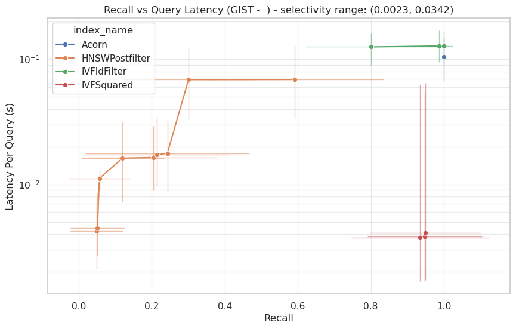
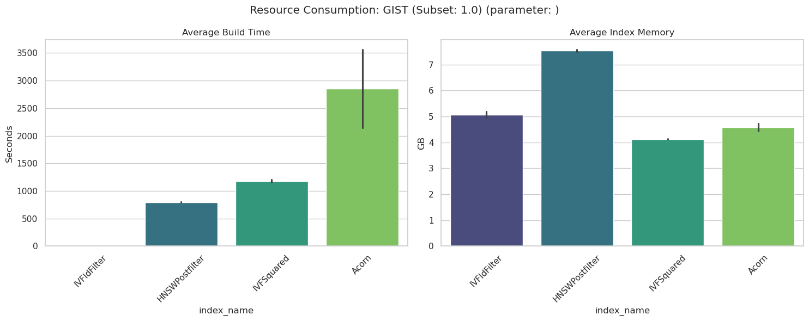

# Benchmarking Filtered Approximate Nearest Neighbor Search (k-ANNS)

## License
This project is licensed under the **MIT License** - see the [LICENSE](LICENSE) file for details.

## Overview
This repository provides a comprehensive benchmarking framework for **Filtered k-Nearest Neighbor Search (k-ANNS)** algorithms. The core challenge addressed is the retrieval of the $k$ most similar vectors to a query vector from a dataset, subject to specific metadata constraints (filters) defined at query time.

The framework supports various constraint types, ranging from simple attribute matching to complex Conjunctive Normal Form (CNF) predicates.

### Performance Metrics
Algorithms are evaluated based on the following four pillars:
* **Recall@k**: The fraction of the true $k$ ground-truth nearest neighbors retrieved by the approximate search.
* **Query Latency**: The total execution time to answer queries (measured in seconds).
* **Index Construction Time**: he total execution time required to build the searchable index.
* **Memory Footprint**: The RAM utilization of the index structure in GB.

---

## Installation & Setup

### 1. Environment Configuration
Clone the repository and initialize the Python environment using the provided Conda configuration:

```bash
git clone https://github.com/Angelosef/benchmark_ANN_filter_algorithms.git
cd benchmark_ANN_filter_algorithms
conda env create -f environment.yml
conda activate ann_bench
````

### 2\. External Dependencies

This benchmark utilizes specialized C++ implementations. You must follow the build instructions within the respective submodules to compile the source code:

  * **ACORN**: High-performance filtered HNSW. Compiled following the instructions of the faiss library.
  * **IVF-Squared**: Inverted file structures pointing at vamana-indices. Compiled following the instructions
  of the ParlayANN library.

-----

## Repository Structure

| Directory/File | Description |
| :--- | :--- |
| `src/algorithms/` | Python wrappers and interfaces for the benchmarked algorithms. |
| `src/benchmark/` | Core `BenchmarkRunner` logic and execution scripts for running algorithms and logging results. |
| `src/datasets/` | Dataset generation, attribute synthesis, and exploratory data analysis. |
| `src/tests/` | Unit tests for the benchmarking pipeline validation. |
| `logger.py` | Centralized utility for recording performance metrics. |
| `plotter.py` | Visualization tools for generating performance charts from log files. |

-----

## Algorithms Under Evaluation

We compare state-of-the-art filtered search techniques against standard baselines:

1.  **Faiss-Flat**: Brute-force search used to establish the **Ground Truth**.
2.  **Faiss IVF (In-filtering)**: Inverted File Index with filtering applied during list scanning.
3.  **Faiss HNSW (Post-filtering)**: Hierarchical Navigable Small Worlds with subsequent filter application.
4.  **ACORN**: An extension of HNSW designed specifically for predicate-based search.
5.  **IVF-Squared**: An optimized index for ANNS with tag filtering with AND constraints on 1-2 tags.

-----

## Datasets

The framework utilizes four primary datasets, summarized below:

| Dataset | Dimensions | Base Size | Query Size | Vector Type | Attribute Type | Filter Logic | 
| :--- | :---: | :---: | :---: | :--- | :--- | :--- |
| **SIFT** | 128 | 1M | 10k | `float32` | Synthetic structured attributes | AND logic on 1, 2, 3 of the attribute columns |
| **GloVe** | 300 | 396k | 4k | `float32` | Synthetic structured attributes | CNF constraints (ANDs of ORs) |
| **YFCC** | 192 | 1M (subset) | 10k | `float32` | semi structured attributes (tags) | AND logic on tags |
| **GIST** | 960 | 1M | 1k | `float32` | synthetic semi structured attributes (tags) | AND logic on tags |

-----

## Execution Guide

**1. Data Preparation**
Generate the synthetic attributes and format the datasets:

```bash
python -m src.datasets.gen_ds
```

**2. Run Benchmarks**
Execute the benchmarking script for a specific algorithm:

```bash
# Available options: acorn, hnsw, ivf, ivf_squared
python -m src.benchmark.[algorithm_name]_bench
```

**3. Postprocessing**
Generate additional data using the raw log - data. Also creates plots to visualize the data in the `/logs` folder.

```bash
python -m src.postprocess
```

**4. Visualization**
Generate performance plots (e.g., Recall vs. Latency curves):

```bash
python -m src.tests.plot_test
```

*Plots will be exported to the `/benchmark_plots` directory.*

-----

## Results
The plots will show the following metrics (this is a sample from the plots that will be generated)

The recall vs latency plots:




The build time + index memory plots




-----

## Computing Setup

  * **Hardware Constraints**: Benchmarking was performed on a consumer-grade setup
  (CPU: intel core i5 - 2.9GHz - 6 cores, 16GB RAM) using OS: Ubuntu 26.04 LTS.
  
-----

## References & Acknowledgments

  * **ACORN**: [Paper (ACM)](https://dl.acm.org/doi/10.1145/3654923)
  * **IVF-Squared/ParlayANN**: [Paper (OpenReview)](https://openreview.net/pdf/8213f79ab3761a0647dbcfea17c73677712ea59c.pdf) | [Source Code](https://github.com/cmuparlay/ParlayANN.git)
  * **Datasets**: Acknowledgement to the maintainers of the SIFT, GIST, GloVe, and YFCC datasets for providing standard vectors for the ANN community.
